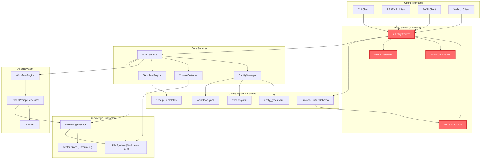
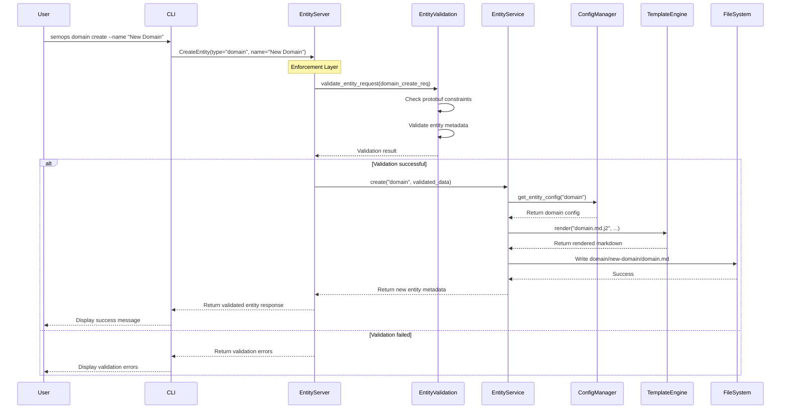
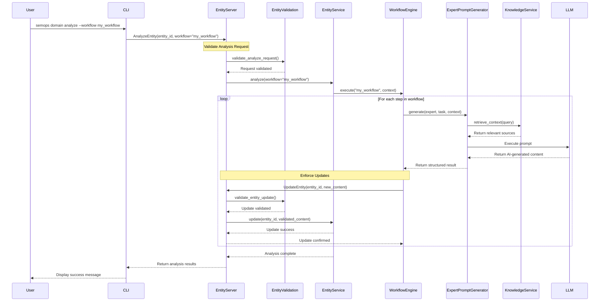
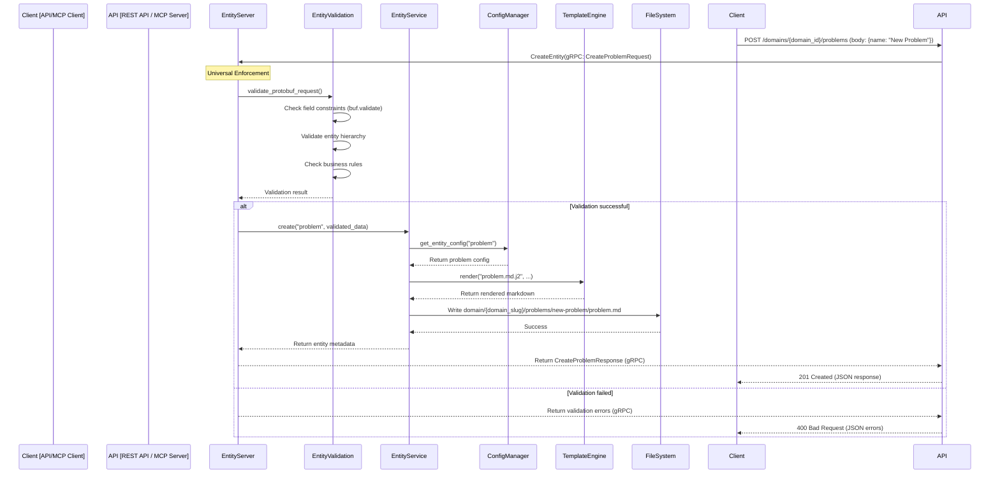

# SemOps2 Architecture Visualization

This document provides a high-level visual overview of the SemOps2 architecture using Mermaid diagrams. It illustrates the interaction between the core components and shows the flow for key operations like entity creation and AI-driven analysis.

## Component Overview

This diagram shows the main architectural components with the enforced entity server as the central authority.

## Operational Flows

These diagrams illustrate the sequence of interactions for specific commands.

### Flow 1: `semops domain create` (Enforced Entity Server)

This shows entity creation through the enforced entity server with validation and constraints.

### Flow 2: `semops domain analyze --workflow ...` (Enforced Updates)

This shows AI-driven analysis with enforced entity updates through the entity server.

### Flow 3: API/MCP `create` Request (Enforced Entity Server)

This shows how external clients interact through the enforced entity server with unified validation.

## Enforced Entity Server Benefits

The enforced entity server architecture provides several key advantages:

### 🔒 Unified Validation
- **Protocol Buffer Schema Enforcement**: All entities must conform to protobuf definitions with buf.validate constraints
- **Business Rule Validation**: Centralized enforcement of entity relationships and constraints
- **Field-Level Validation**: Automatic validation of entity metadata, IDs, hierarchies, and custom fields

### 🚀 Multi-Client Support
- **Universal Interface**: CLI, REST API, MCP, and Web UI all use the same validation logic
- **Consistent Behavior**: Identical entity handling across all client interfaces
- **Type Safety**: Protocol buffer definitions ensure type safety across language boundaries

### 📊 Centralized Authority
- **Single Source of Truth**: All entity operations go through the entity server
- **Audit Trail**: Complete tracking of entity creation, updates, and analysis operations
- **Security Enforcement**: Centralized access control and permission validation

### 🔄 Workflow Integration
- **AI Workflow Validation**: Even AI-generated content must pass through entity validation
- **Update Consistency**: All entity updates, whether manual or AI-driven, follow the same validation rules
- **Rollback Safety**: Failed validations prevent inconsistent states

### 🛠️ Development Benefits
- **Schema Evolution**: Protocol buffer schema allows for backward-compatible changes
- **Code Generation**: Automatic client code generation for multiple languages
- **Documentation**: OpenAPI and markdown docs generated from schema
- **Testing**: Consistent validation logic enables comprehensive testing
