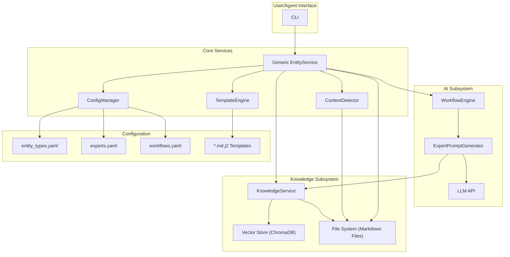
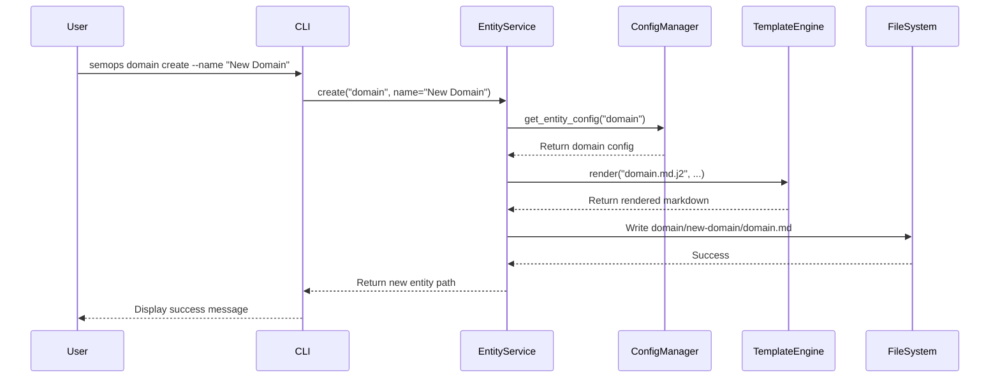
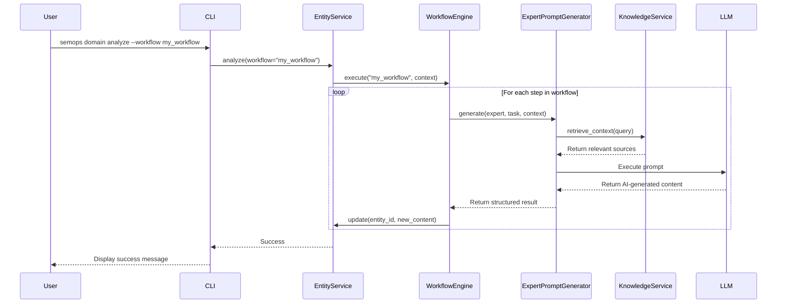
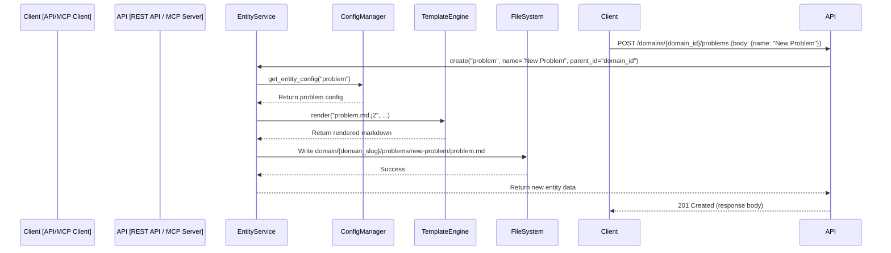

# SemOps2 Architecture Visualization

This document provides a high-level visual overview of the SemOps2 architecture using Mermaid diagrams. It illustrates the interaction between the core components and shows the flow for key operations like entity creation and AI-driven analysis.

## Component Overview

This diagram shows the main architectural components and their primary relationships.

## Operational Flows

These diagrams illustrate the sequence of interactions for specific commands.

### Flow 1: `semops domain create`

This shows a simple entity creation workflow without AI-driven content generation.

### Flow 2: `semops domain analyze --workflow ...`

This shows the more complex, multi-expert workflow for AI-driven analysis and content generation.

### Flow 3: API/MCP `create` Request

This shows how a non-CLI client, like a REST API or MCP server, interacts with the services. Note that context is provided explicitly in the request, bypassing the filesystem `ContextDetector`.

