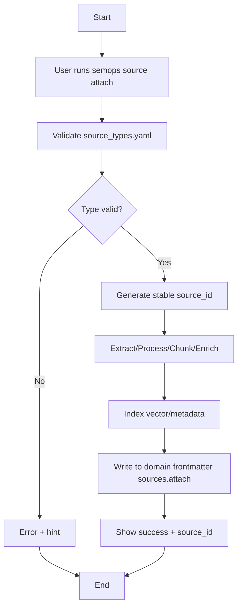

# Narrative 02 — Attach Sources at Domain Level

## Purpose
Attach broad, foundational sources to a domain so that descendants inherit context by default.

## Actors
- Strategist (primary)
- SemOps CLI

## Preconditions
- Domain exists (see Narrative 01)
- `config/source_types.yaml` defines `web_page` (or relevant types)

## Narrative
1. Strategist identifies a key reference (e.g., NCSC Cloud Security Principles).
2. Runs `semops source attach --type web_page --url https://www.ncsc.gov.uk/collection/cloud-security-principles` in the domain directory.
3. CLI validates the source type and generates a stable `source_id` (URL-hash-based).
4. CLI processes the source (extract → process → chunk → enrich), then indexes it.
5. Domain frontmatter is updated: `sources.attach` includes the `source_id` with metadata.

## Success Criteria
- Domain frontmatter includes the attached `source_id` with metadata.
- Source is processed and indexed; ready for inheritance.

## Mermaid (Flow)

## Related BDD
- Attach sources at the domain level
- Inherit sources from ancestors (see Narrative 03)
