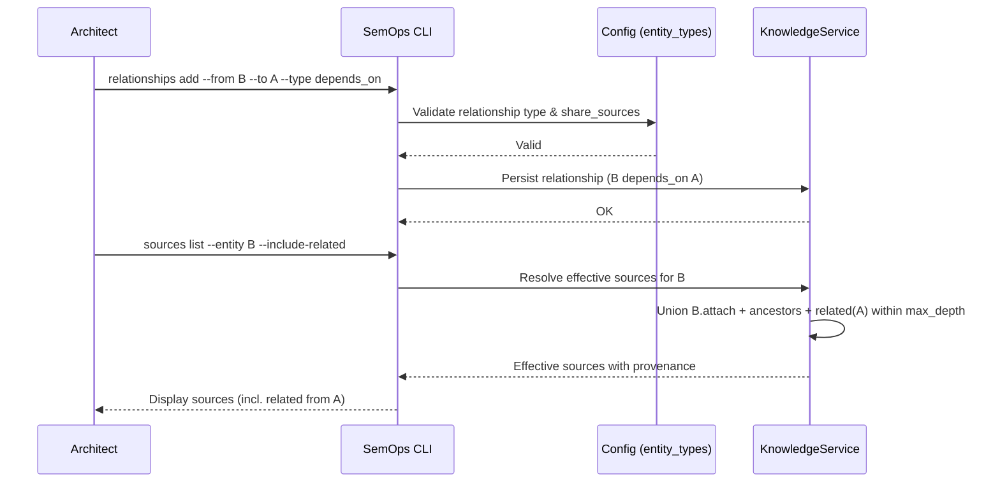

# Narrative 05 — Cross-Domain Source Sharing

## Purpose
Enable a domain to declare a relationship (e.g., `depends_on`) to another domain and optionally share sources according to policy.

## Actors
- Architect (primary)
- SemOps CLI

## Preconditions
- Two domains exist (e.g., "Cloud Security Governance" and "Platform Engineering")
- Relationship type configured in `entity_types.yaml` with `share_sources: true` and `max_depth`
- Domain A has attached sources

## Narrative
1. Architect establishes a relationship: Domain B `depends_on` Domain A.
2. Architect runs `semops relationships add --from B --to A --type depends_on`.
3. CLI records the relationship and validates `share_sources` policy.
4. Architect lists sources for Domain B with related included.
5. CLI unions eligible sources from Domain A into Domain B’s effective list, marking provenance and respecting `max_depth`.

## Success Criteria
- Relationship is stored and visible via `semops relationships list`.
- Listing sources for Domain B (with related) includes Domain A’s eligible sources with provenance.

## Mermaid (Sequence)

## Related BDD
- Roots and cross-domain relationships
- Share sources across related domains
